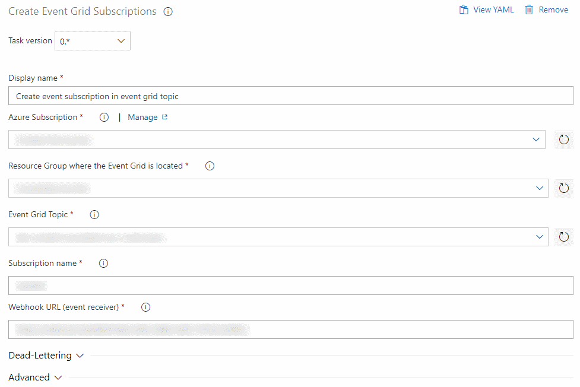

# Create Azure Event Grid Subscriptions

This extension can create and modify event grid subscriptions.

Read the Microsoft documentation to learn about Azure Event Grid and 
subscribing to events:

* [Azure Event Grid documentation](https://docs.microsoft.com/en-us/azure/event-grid/)
* [Quickstart: Route custom events to web endpoint](https://docs.microsoft.com/en-us/azure/event-grid/custom-event-quickstart-portal)
* [Powershell command to create subscriptions](https://docs.microsoft.com/en-us/powershell/module/az.eventgrid/new-azeventgridsubscription)

You must pass in an Azure Resource Manager Subscription (a service connection
in Azure DevOps), and information about the Event Grid Topic to create the
subscription in, as well as other information that is required to create
the subscription.

Azure Event Grid will verify that the receiver is functioning and ready to handle
events.

## Usage

TODO: update screenshot

To configure the Event Grid Subscription task, first select an Azure Resource
Manager service connection or Azure subscription.

Next, choose the resource group in which the Event Grid Topic is located.

Enter the URL to use as target for the subscription, and optionally configure
dead letter storage account, retries, etc.

## Security

The extension does not store or transfer or otherwise leak your Cosmos DB keys.
The full extension source is available on
[the GitHub project page](https://github.com/rwatjen/EventGridSubscriptionExtension).

## Limitations

The extenion does not work with service connections that use certificate 
authentication.

## Questions

If you need help, please go to the 
[GitHub issues page](https://github.com/rwatjen/EventGridSubscriptionExtension/issues).

If you want to help improve the extension; perhaps it doesn't do quite what
you need, then feel free to reach out via GitHub as well.
